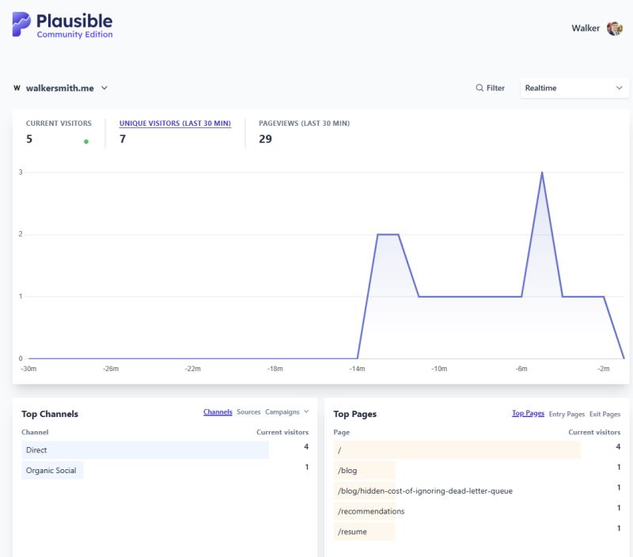

📊 Just added analytics to my personal site, and here's why I'm sharing it early.
I recently integrated Plausible Analytics to start tracking what people engage with. It’s still early. Not much traffic yet, and no real insights to speak of — but that’s kind of the point. I want to build with feedback, not in a vacuum.

If you’re a creator, engineer, or indie builder:
 👉 What are you learning from your own analytics?
 👉 How do you decide what content or projects are worth pursuing?

I'd love to hear how you're thinking about growth, curiosity, and the signals that help guide you.

https://walkersmith.me/blog

#buildinpublic #developerlife #techblog #creators #plausibleanalytics

https://www.linkedin.com/posts/walkerrandolphsmith_buildinpublic-developerlife-techblog-activity-7349083333395431424-5I3Y?utm_source=share&utm_medium=member_desktop&rcm=ACoAAAqnqGQB9vu4sAnxFYA9TgPi-2AeQbt3qsE