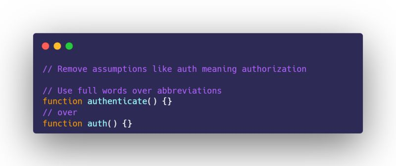

➡️ Use full words like authenticate or authorization instead of abbreviations like auth.

💡It can prevent assumptions when seeing the code out of context 

#CleanCode #DeveloperTips #JavaScript #CodeReadability #SoftwareEngineering

https://www.linkedin.com/posts/walkerrandolphsmith_cleancode-developertips-javascript-activity-7350485540867072002-M9ge?utm_source=share&utm_medium=member_desktop&rcm=ACoAAAqnqGQB9vu4sAnxFYA9TgPi-2AeQbt3qsE